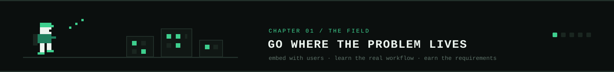
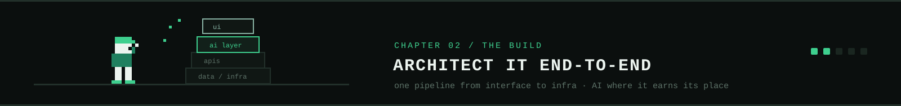
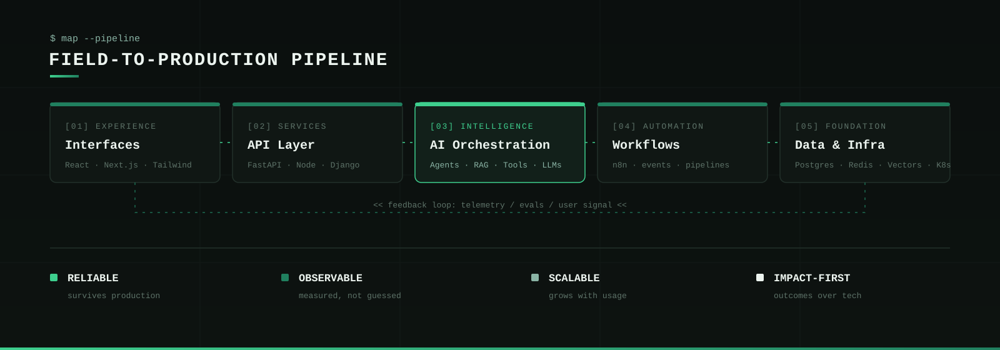
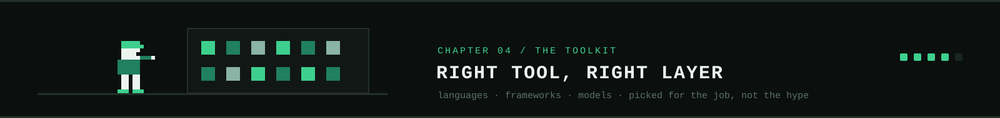
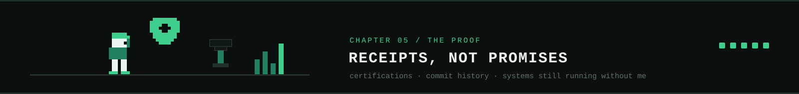

<br/>

<p align="center">
  <a href="https://www.hassannazir.dev">
    
  </a>&nbsp;&nbsp;
  <a href="https://n8nhub.hassannazir.dev">
    
  </a>&nbsp;&nbsp;
  <a href="https://www.linkedin.com/in/hassannazirrr/">
    
  </a>&nbsp;&nbsp;
  <a href="mailto:hassannazir955@gmail.com">
    
  </a>&nbsp;&nbsp;
  
</p>

<br/>

**Forward Deployed Engineer** based in Islamabad, Pakistan. I take ambiguous customer problems from technical discovery to production in live environments: embed with the actual users, learn the actual workflow, then build and ship the system end-to-end. Full-stack engineering is the foundation; applied AI and intelligent automation are the force multipliers.

Hands-on across the stack (React, Next.js, TypeScript, NestJS, Python) and in applied AI (LLM systems, RAG, multi-agent orchestration, MCP), with a track record of owning outcomes through adoption, not just delivery.

> **Still learning, always shipping.** I build software that can reason, act, automate, and survive production.

```text
> STATUS -----------------------------------------------------------------
  [#########.] currently  : AI Architect @ Uno O.S. (production AI systems & agent infra)
  [########..] shipping   : full-stack platforms in React/Next.js + NestJS/PostgreSQL
  [#######...] also       : growing n8nHub, a library of reusable AI automation workflows
  [######....] exploring  : agent-native software, MCP servers, local models
  [##########] always     : shipping
```


### At a Glance

<table width="100%">
<tr>
<td width="20%" align="center"><b>99.9%</b><br/><sub>Production Reliability</sub></td>
<td width="20%" align="center"><b>10K+</b><br/><sub>Daily Automated Transactions</sub></td>
<td width="20%" align="center"><b>10K+</b><br/><sub>Users on Shipped Platforms</sub></td>
<td width="20%" align="center"><b>100+</b><br/><sub>AI Automation Solutions Delivered</sub></td>
<td width="20%" align="center"><b>40%</b><br/><sub>Operational Cost Reduction</sub></td>
</tr>
</table>

<br/>



<table width="100%" cellspacing="0" cellpadding="8">
<tr>
<td width="50%" valign="top">

#### 🎯 Forward Deployment

Embedding with real users and real constraints. Requirements discovery, rapid prototyping, on-the-ground iteration, and turning ambiguous business problems into deployed, measurable software.

</td>
<td width="50%" valign="top">

#### 🧱 Full-Stack Engineering

Frontend applications, backend services, REST APIs, authentication, microservices, data layers, and product architecture that scales past the demo.

</td>
</tr>
<tr>
<td width="50%" valign="top">

#### 🧠 Applied AI

LLM applications, agentic systems, RAG pipelines, vector search, fine-tuning, tool use, prompt systems, and production AI orchestration - applied to real workflows, not benchmarks.

</td>
<td width="50%" valign="top">

#### ⚙️ Automation & Infra

Business process automation, AI-integrated workflows, event-driven pipelines, scraping and data extraction - deployed on Docker, Kubernetes, CI/CD, with observability built in.

</td>
</tr>
</table>







<table width="100%" cellspacing="0" cellpadding="0">
<tr>
<td width="64%" valign="top" style="padding:18px 22px;background:#101714;border:1px solid #22302a;border-right:none;border-radius:8px 0 0 8px;">
<h3>n8nHub</h3>
<p>A platform and growing library of reusable n8n workflows and AI automations. Built to make powerful automation patterns easier to discover, understand, reuse, and ship.</p>
<a href="https://n8nhub.hassannazir.dev"></a>
<br/><br/>


</td>
<td width="36%" valign="middle" style="background:#12201a;border:1px solid #22302a;border-left:none;border-radius:0 8px 8px 0;overflow:hidden;">

</td>
</tr>
</table>

<br/>

<table width="100%" cellspacing="0" cellpadding="0">
<tr>
<td width="64%" valign="top" style="padding:18px 22px;background:#101714;border:1px solid #22302a;border-right:none;border-radius:8px 0 0 8px;">
<h3>WonderKit</h3>
<p>An open-source, agent-native AI SaaS project exploring a software model where agents, tools, context, and intelligent workflows are first-class building blocks.</p>
<a href="https://github.com/zimkk/wonderkit"></a>
<br/><br/>


</td>
<td width="36%" valign="middle" style="background:#12201a;border:1px solid #22302a;border-left:none;border-radius:0 8px 8px 0;overflow:hidden;">

</td>
</tr>
</table>

<br/>

<table width="100%" cellspacing="0" cellpadding="0">
<tr>
<td width="64%" valign="top" style="padding:18px 22px;background:#101714;border:1px solid #22302a;border-right:none;border-radius:8px 0 0 8px;">
<h3>Mynecraft</h3>
<p>A Minecraft-style sandbox that runs in the browser. A technical exploration of 3D rendering, WebGL, interactive worlds, and game systems built for the web.</p>
<a href="https://github.com/zimkk/mynecraft"></a>
<br/><br/>


</td>
<td width="36%" valign="middle" style="background:#12201a;border:1px solid #22302a;border-left:none;border-radius:0 8px 8px 0;overflow:hidden;">

</td>
</tr>
</table>

<br/>

<table width="100%" cellspacing="0" cellpadding="0">
<tr>
<td width="64%" valign="top" style="padding:18px 22px;background:#101714;border:1px solid #22302a;border-right:none;border-radius:8px 0 0 8px;">
<h3>Legal Document Summarizer</h3>
<p>An AI document-processing application focused on transforming dense legal documents into useful summaries and extracted information.</p>
<a href="https://github.com/zimkk/legal-Document-Summerizer"></a>
<br/><br/>


</td>
<td width="36%" valign="middle" style="background:#12201a;border:1px solid #22302a;border-left:none;border-radius:0 8px 8px 0;overflow:hidden;">

</td>
</tr>
</table>

<br/>

<table width="100%" cellspacing="0" cellpadding="0">
<tr>
<td width="64%" valign="top" style="padding:18px 22px;background:#101714;border:1px solid #22302a;border-right:none;border-radius:8px 0 0 8px;">
<h3>Anomaly Detection System</h3>
<p>A machine learning project focused on identifying anomalous behavior from structured data and applying statistical and ML-based detection techniques.</p>
<a href="https://github.com/zimkk/Anomaly-Detection-System"></a>
<br/><br/>


</td>
<td width="36%" valign="middle" style="background:#12201a;border:1px solid #22302a;border-left:none;border-radius:0 8px 8px 0;overflow:hidden;">

</td>
</tr>
</table>



**Languages**


**AI · ML · LLM Systems**


**Frontend**


**Backend & APIs**


**Automation & Data**


**Databases**


**Cloud · DevOps · Tools**




**Experience**

<table width="100%">
<tr><td><b>Uno O.S.</b> · AI Architect</td><td align="right"><sub>Apr 2026 – Present</sub></td></tr>
<tr><td colspan="2"><sub>Architecting production AI systems and agent infrastructure; evaluation, monitoring, and rollout patterns that ship reliably and scale across teams.</sub></td></tr>
<tr><td><b>Gridcore</b> · Lead Full-Stack & AI Engineer</td><td align="right"><sub>Dec 2023 – Jun 2026</sub></td></tr>
<tr><td colspan="2"><sub>Took enterprise clients from ambiguous problem framing through discovery, build, and deployment. Full-stack products in React/Next.js + NestJS/PostgreSQL, RAG pipelines on real client data, an 8-agent orchestration platform, 99.9% reliability.</sub></td></tr>
<tr><td><b>NDT Legacy Group</b> · Senior AI Engineer</td><td align="right"><sub>Aug 2025 – Apr 2026</sub></td></tr>
<tr><td colspan="2"><sub>Enterprise AI automation platforms processing 10K+ daily transactions at 99.9% uptime; 40% cost reduction through intelligent automation.</sub></td></tr>
<tr><td><b>Schmoozzer</b> · Senior AI Engineer (Contract)</td><td align="right"><sub>Oct 2025 – Jan 2026</sub></td></tr>
<tr><td><b>Brilliant Gaming LLC</b> · QA Automation Engineer (Contract)</td><td align="right"><sub>Feb 2025 – Sep 2025</sub></td></tr>
<tr><td><b>Independent Consultant</b> · Upwork / Fiverr</td><td align="right"><sub>2019 – Present</sub></td></tr>
<tr><td colspan="2"><sub>100+ AI automation solutions, 20+ LLM fine-tuning projects, no-code AI workflows serving 10K+ users.</sub></td></tr>
</table>

**Education**

- **BS Computer Science** · Air University, Islamabad (2020 – 2024) · Focus: AI, Machine Learning, Data & Cloud

**Certifications**

- **Certified Ethical Hacker Practical (CEH-P)** · NUST-NCAI / NAVTTC, 2024
- **Practical Ethical Hacking (PEH)** · TCM Security, 2023
- **ISO/IEC 27001 Information Security Associate** · SkillFront, 2023


<div align="center">

</div>

<div align="center">
<picture>
<source media="(prefers-color-scheme: dark)" srcset="https://raw.githubusercontent.com/zimkk/zimkk/output/github-contribution-grid-snake-dark.svg"/>
<source media="(prefers-color-scheme: light)" srcset="https://raw.githubusercontent.com/zimkk/zimkk/output/github-contribution-grid-snake.svg"/>

</picture>
</div>

<br/>


