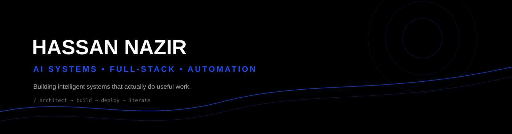
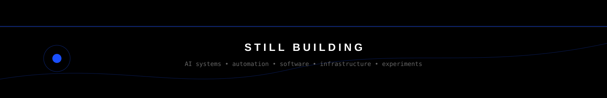

<br/>

<p align="center">
  <a href="https://www.hassannazir.dev">
    
  </a>&nbsp;&nbsp;
  <a href="https://n8nhub.hassannazir.dev">
    
  </a>&nbsp;&nbsp;
  <a href="https://www.linkedin.com/in/hassannazirrr/">
    
  </a>&nbsp;&nbsp;
  <a href="mailto:hassannazir955@gmail.com">
    
  </a>&nbsp;&nbsp;
  
</p>

<br/>

𝘐 𝘣𝘶𝘪𝘭𝘥 𝘈𝘐-𝘯𝘢𝘵𝘪𝘷𝘦 𝘴𝘺𝘴𝘵𝘦𝘮𝘴 𝘵𝘩𝘢𝘵 𝘤𝘰𝘯𝘯𝘦𝘤𝘵 𝘪𝘯𝘵𝘦𝘭𝘭𝘪𝘨𝘦𝘯𝘤𝘦 𝘸𝘪𝘵𝘩 𝘦𝘹𝘦𝘤𝘶𝘵𝘪𝘰𝘯. 𝘐 𝘸𝘰𝘳𝘬 𝘢𝘤𝘳𝘰𝘴𝘴 𝘓𝘓𝘔 𝘢𝘱𝘱𝘭𝘪𝘤𝘢𝘵𝘪𝘰𝘯𝘴, 𝘢𝘨𝘦𝘯𝘵𝘪𝘤 𝘴𝘺𝘴𝘵𝘦𝘮𝘴, 𝘙𝘈𝘎 𝘱𝘪𝘱𝘦𝘭𝘪𝘯𝘦𝘴, 𝘸𝘰𝘳𝘬𝘧𝘭𝘰𝘸 𝘢𝘶𝘵𝘰𝘮𝘢𝘵𝘪𝘰𝘯, 𝘧𝘶𝘭𝘭-𝘴𝘵𝘢𝘤𝘬 𝘱𝘭𝘢𝘵𝘧𝘰𝘳𝘮𝘴, 𝘢𝘯𝘥 𝘵𝘩𝘦 𝘪𝘯𝘧𝘳𝘢𝘴𝘵𝘳𝘶𝘤𝘵𝘶𝘳𝘦 𝘵𝘩𝘢𝘵 𝘮𝘢𝘬𝘦𝘴 𝘵𝘩𝘦𝘮 𝘶𝘴𝘦𝘧𝘶𝘭 𝘪𝘯 𝘱𝘳𝘰𝘥𝘶𝘤𝘵𝘪𝘰𝘯.

𝘈𝘐 𝘈𝘶𝘵𝘰𝘮𝘢𝘵𝘪𝘰𝘯 𝘌𝘯𝘨𝘪𝘯𝘦𝘦𝘳 · 𝘍𝘶𝘭𝘭-𝘚𝘵𝘢𝘤𝘬 𝘌𝘯𝘨𝘪𝘯𝘦𝘦𝘳 · 𝘚𝘺𝘴𝘵𝘦𝘮𝘴 𝘉𝘶𝘪𝘭𝘥𝘦𝘳 &nbsp;|&nbsp; 𝘗𝘢𝘬𝘪𝘴𝘵𝘢𝘯

𝑺𝒕𝒊𝒍𝒍 𝒍𝒆𝒂𝒓𝒏𝒊𝒏𝒈, 𝒂𝒍𝒘𝒂𝒚𝒔 𝒔𝒉𝒊𝒑𝒑𝒊𝒏𝒈. 𝑰 𝒍𝒊𝒌𝒆 𝒃𝒖𝒊𝒍𝒅𝒊𝒏𝒈 𝒔𝒐𝒇𝒕𝒘𝒂𝒓𝒆 𝒕𝒉𝒂𝒕 𝒄𝒂𝒏 𝒓𝒆𝒂𝒔𝒐𝒏, 𝒂𝒄𝒕, 𝒂𝒖𝒕𝒐𝒎𝒂𝒕𝒆, 𝒂𝒏𝒅 𝒔𝒖𝒓𝒗𝒊𝒗𝒆 𝒑𝒓𝒐𝒅𝒖𝒄𝒕𝒊𝒐𝒏.

---

### 𝗔𝘁 𝗮 𝗚𝗹𝗮𝗻𝗰𝗲

<table width="100%">
<tr>
<td width="25%" align="center"><b>3+</b><br/><sub>Years in AI & Automation</sub></td>
<td width="25%" align="center"><b>10K+</b><br/><sub>Users on AI Platforms</sub></td>
<td width="25%" align="center"><b>10K+</b><br/><sub>Daily Automated Transactions</sub></td>
<td width="25%" align="center"><b>40%</b><br/><sub>Operational Cost Reduction</sub></td>
</tr>
</table>

<br/>

---

### 𝗪𝗵𝗮𝘁 𝗜 𝗕𝘂𝗶𝗹𝗱

<table width="100%" cellspacing="0" cellpadding="8">
<tr>
<td width="50%" valign="top">

#### 𝘼𝙄 & 𝙇𝙇𝙈 𝙎𝙮𝙨𝙩𝙚𝙢𝙨

LLM applications, RAG pipelines, vector search, fine-tuning, model integration, prompt systems, multi-agent architectures, tool use, and production AI orchestration.

</td>
<td width="50%" valign="top">

#### 𝙁𝙪𝙡𝙡-𝙎𝙩𝙖𝙘𝙠 𝙋𝙡𝙖𝙩𝙛𝙤𝙧𝙢𝙨

Frontend applications, backend services, REST APIs, authentication systems, microservices, data layers, and scalable product architecture.

</td>
</tr>
<tr>
<td width="50%" valign="top">

#### 𝘼𝙪𝙩𝙤𝙢𝙖𝙩𝙞𝙤𝙣 & 𝙊𝙧𝙘𝙝𝙚𝙨𝙩𝙧𝙖𝙩𝙞𝙤𝙣

Business process automation, AI-integrated workflows, web scraping, data extraction, event-driven pipelines, and workflow orchestration.

</td>
<td width="50%" valign="top">

#### 𝙄𝙣𝙛𝙧𝙖 & 𝘿𝙚𝙫𝙊𝙥𝙨

Cloud deployments, Docker, Kubernetes, CI/CD, ML deployment pipelines, observability, monitoring, and production operations.

</td>
</tr>
</table>

---

### 𝗔𝗿𝗰𝗵𝗶𝘁𝗲𝗰𝘁𝘂𝗿𝗲 𝗔𝗽𝗽𝗿𝗼𝗮𝗰𝗵

```text
┌──────────────────────────────────────────────────────────────┐
│                    USER APPLICATIONS                         │
│                React · Next.js · Web Interfaces              │
└──────────────────────────────┬───────────────────────────────┘
                               ↓
┌──────────────────────────────────────────────────────────────┐
│                         API LAYER                            │
│           FastAPI · Node.js · Express · Django               │
└──────────────────────────────┬───────────────────────────────┘
                               ↓
┌──────────────────────────────────────────────────────────────┐
│                    AI ORCHESTRATION                          │
│        Agents · LangChain · Tools · Workflows                │
└──────────────────────────────┬───────────────────────────────┘
                               ↓
┌──────────────────────────────────────────────────────────────┐
│                 MODELS & INTELLIGENCE                        │
│       LLMs · Fine-Tuned Models · RAG · Vector Search          │
└──────────────────────────────┬───────────────────────────────┘
                               ↓
┌──────────────────────────────────────────────────────────────┐
│                         DATA LAYER                           │
│ PostgreSQL · MongoDB · Redis · Vector Databases · Supabase   │
└──────────────────────────────────────────────────────────────┘
```

Built for reliability, scalability, observability, and measurable business impact.

---

### 𝗣𝗿𝗼𝗷𝗲𝗰𝘁𝘀

<table width="100%" cellspacing="0" cellpadding="0">
<tr>
<td width="64%" valign="top" style="padding:18px 22px;background:#0d1117;border:1px solid #30363d;border-right:none;border-radius:8px 0 0 8px;">
<h3>n8nHub</h3>
<p>A platform and growing library of reusable n8n workflows and AI automations. Built to make powerful automation patterns easier to discover, understand, reuse, and ship.</p>
<a href="https://n8nhub.hassannazir.dev"></a>
<br/><br/>


</td>
<td width="36%" valign="middle" style="background:#161b22;border:1px solid #30363d;border-left:none;border-radius:0 8px 8px 0;overflow:hidden;">

</td>
</tr>
</table>

<br/>

<table width="100%" cellspacing="0" cellpadding="0">
<tr>
<td width="64%" valign="top" style="padding:18px 22px;background:#0d1117;border:1px solid #30363d;border-right:none;border-radius:8px 0 0 8px;">
<h3>WonderKit</h3>
<p>An open-source, agent-native AI SaaS project exploring a software model where agents, tools, context, and intelligent workflows are first-class building blocks.</p>
<a href="https://github.com/zimkk/wonderkit"></a>
<br/><br/>


</td>
<td width="36%" valign="middle" style="background:#161b22;border:1px solid #30363d;border-left:none;border-radius:0 8px 8px 0;overflow:hidden;">

</td>
</tr>
</table>

<br/>

<table width="100%" cellspacing="0" cellpadding="0">
<tr>
<td width="64%" valign="top" style="padding:18px 22px;background:#0d1117;border:1px solid #30363d;border-right:none;border-radius:8px 0 0 8px;">
<h3>Mynecraft</h3>
<p>A Minecraft-style sandbox that runs in the browser. A technical exploration of 3D rendering, WebGL, interactive worlds, and game systems built for the web.</p>
<a href="https://github.com/zimkk/mynecraft"></a>
<br/><br/>


</td>
<td width="36%" valign="middle" style="background:#161b22;border:1px solid #30363d;border-left:none;border-radius:0 8px 8px 0;overflow:hidden;">

</td>
</tr>
</table>

<br/>

<table width="100%" cellspacing="0" cellpadding="0">
<tr>
<td width="64%" valign="top" style="padding:18px 22px;background:#0d1117;border:1px solid #30363d;border-right:none;border-radius:8px 0 0 8px;">
<h3>Legal Document Summarizer</h3>
<p>An AI document-processing application focused on transforming dense legal documents into useful summaries and extracted information.</p>
<a href="https://github.com/zimkk/legal-Document-Summerizer"></a>
<br/><br/>


</td>
<td width="36%" valign="middle" style="background:#161b22;border:1px solid #30363d;border-left:none;border-radius:0 8px 8px 0;overflow:hidden;">

</td>
</tr>
</table>

<br/>

<table width="100%" cellspacing="0" cellpadding="0">
<tr>
<td width="64%" valign="top" style="padding:18px 22px;background:#0d1117;border:1px solid #30363d;border-right:none;border-radius:8px 0 0 8px;">
<h3>Anomaly Detection System</h3>
<p>A machine learning project focused on identifying anomalous behavior from structured data and applying statistical and ML-based detection techniques.</p>
<a href="https://github.com/zimkk/Anomaly-Detection-System"></a>
<br/><br/>


</td>
<td width="36%" valign="middle" style="background:#161b22;border:1px solid #30363d;border-left:none;border-radius:0 8px 8px 0;overflow:hidden;">

</td>
</tr>
</table>

---

### 𝗠𝘆 𝗧𝗲𝗰𝗵 𝗦𝘁𝗮𝗰𝗸

**Languages**


**AI · ML · LLM Systems**


**Frontend**


**Backend & APIs**


**Automation & Data**


**Databases**


**Cloud · DevOps · Tools**


---

### 𝗖𝗲𝗿𝘁𝗶𝗳𝗶𝗰𝗮𝘁𝗶𝗼𝗻𝘀

- **Certified Ethical Hacker – Practical (CEH-P)**
- **Practical Ethical Hacking (PEH)**
- **ISO/IEC 27001 Information Security Associate**

---

### 𝗦𝘁𝗮𝘁𝘀

<div align="center">


</div>

<div align="center">

</div>

<div align="center">
<picture>
<source media="(prefers-color-scheme: dark)" srcset="https://raw.githubusercontent.com/zimkk/zimkk/output/github-contribution-grid-snake-dark.svg"/>
<source media="(prefers-color-scheme: light)" srcset="https://raw.githubusercontent.com/zimkk/zimkk/output/github-contribution-grid-snake.svg"/>

</picture>
</div>

<br/>


